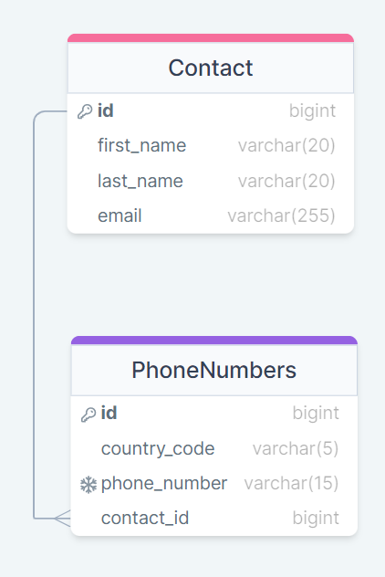

# Simple Contacts App Using Django

simple contacts app using django contained in docker image that enables you to add new contact and numbers to the contact and ther is a page that shows all contacts in the app and another page to get each contact details.
access index page using the following link
http://127.0.0.1:8000/ContactsApp/

## Database Schema

the Database is simple as there is no many features in the app
it has to tables, contact and phone numbers with one to many relationship as one contact may have many numbers. for contact table each contact has Id, first name and last name, while phone number has contact id as foreign key and country code and phone number which is unique to avoid dublicates